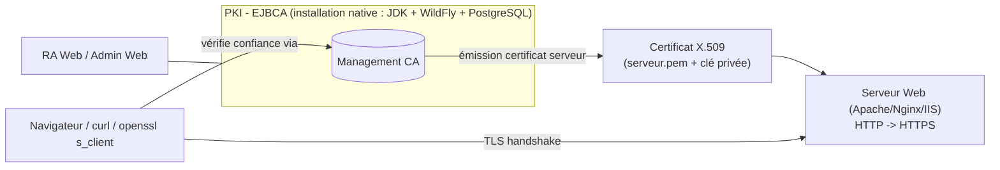

# Mise en place d'une Autorité de Certification (PKI) avec EJBCA et passage de HTTP vers HTTPS

Projet de cours — Master SSI, Cryptographie (2026).
Équipe de 3 personnes, une branche Git par membre.

## 1. Objectif

Déployer une PKI privée avec **EJBCA Community** (Enterprise Java Beans Certificate Authority),
émettre un certificat serveur depuis cette CA, puis migrer un serveur web d'**HTTP vers HTTPS**
en utilisant ce certificat.

Livrables :
- Une PKI fonctionnelle (Management CA, profils de certificats, End Entity).
- Un serveur web migré de HTTP → HTTPS avec le certificat émis par notre CA.
- Un rapport expliquant les concepts (PKI, X.509, chaîne de confiance, CRL/OCSP) et les choix faits.
- Une démo reproductible + captures/preuves (openssl s_client, navigateur, CRL).

## 2. Statut actuel du projet

### ✅ Fait (Ahmad)
JDK/Ant/PostgreSQL installés, EJBCA compilé, WildFly configuré, Management CA créée, SuperAdmin créé.

### 🔄 Ahmad — en cours
- Télécharger/importer le `.p12` SuperAdmin, se connecter à l'Admin Web
- Créer profil "SERVER" + émettre le certificat pour le serveur de démo de Papa
- Captures d'écran + section rapport

### ⏳ Papa Mamadou — tout reste à faire
Serveur web natif (Apache/Nginx/IIS), CSR, HTTPS, redirection, durcissement TLS, tests, captures,
section rapport.

### ⏳ Mame Fama — tout reste à faire
Révocation/CRL, audit TLS indépendant, comparatif CA privée/publique, scénarios de test 1-5.

Détail complet, tâche par tâche : [docs/repartition-des-taches.md](docs/repartition-des-taches.md).

## 3. Architecture



- **EJBCA Community**, compilé depuis les sources (`ant deployear`) et déployé sur
  **WildFly 39**, avec **PostgreSQL 17** comme base de données.
- **Pas de Docker** : la machine d'Ahmad n'a pas la virtualisation activée en BIOS, donc tout
  tourne en natif (JDK 17, Apache Ant, WildFly, PostgreSQL installés directement sur Windows).
  Voir le choix détaillé dans [docs/journal-installation-ejbca-natif.md](docs/journal-installation-ejbca-natif.md).
- **Management CA** auto-signée (RSA 4096, SHA256WithRSA) qui émet directement les certificats
  "End Entity" (serveur, SuperAdmin).
- Un **serveur web** (Apache, Nginx ou IIS, au choix de Papa) initialement en HTTP,
  reconfiguré en HTTPS avec le certificat émis par la CA, avec redirection HTTP → HTTPS.
- Le certificat racine (Management CA) est ajouté au **truststore** du client pour valider la
  chaîne sans avertissement de sécurité.

## 4. Répartition du travail (3 branches)

| Branche | Responsable | Contenu |
|---|---|---|
| `pki-ejbca-setup` | Ahmad Diop | Installation native d'EJBCA (JDK/Ant/WildFly/PostgreSQL), création de la Management CA, du SuperAdmin, des profils de certificats, émission du certificat serveur |
| `webserver-https-migration` | Papa Mamadou | Serveur web de démo en HTTP, migration vers HTTPS avec le certificat EJBCA, redirection HTTP→HTTPS, durcissement TLS (protocoles/ciphers), vérification avec `openssl s_client` / `testssl.sh` |
| `docs-rapport-tests` | Mame Fama | **Rôle technique** : révocation d'un certificat + vérification CRL (hands-on EJBCA), audit de sécurité TLS indépendant (`testssl.sh`/`nmap`), comparatif CA privée vs CA publique, exécution des scénarios de test 1-5 |

Chaque branche pousse son travail puis ouvre une Pull Request vers `main` pour relecture croisée.
Voir [docs/repartition-des-taches.md](docs/repartition-des-taches.md) pour le détail des tâches.

## 5. Installation d'EJBCA (native, sans Docker)

Étapes détaillées, commandes exactes et difficultés rencontrées :
[docs/journal-installation-ejbca-natif.md](docs/journal-installation-ejbca-natif.md).

Résumé :
1. Installer JDK 17, Apache Ant, PostgreSQL 17.
2. Créer la base `ejbca` et l'utilisateur dédié dans PostgreSQL.
3. Télécharger les sources EJBCA Community et les compiler (`ant deployear`).
4. Installer WildFly, y déployer le driver JDBC PostgreSQL et l'EAR généré.
5. Configurer le datasource `EjbcaDS` dans WildFly (`jboss-cli`).
6. Créer la Management CA et le SuperAdmin via `bin/ejbca.sh` (CLI EJBCA).
7. Récupérer le certificat client SuperAdmin via la RA Web et se connecter à l'Admin Web.

## 6. Migration HTTP → HTTPS

À réaliser par Papa Mamadou (voir la checklist dans
[docs/repartition-des-taches.md](docs/repartition-des-taches.md)) : serveur web natif, CSR,
certificat signé par la Management CA d'Ahmad, configuration HTTPS + redirection + durcissement TLS.

## 7. Ressources utilisées

- [EJBCA - The Open-Source Certificate Authority](https://www.ejbca.org/)
- [EJBCA-CE sur GitHub (Keyfactor)](https://github.com/Keyfactor/ejbca-ce)
- [Tutorial - Create your first Root CA using EJBCA (Keyfactor Docs)](https://docs.keyfactor.com/ejbca/latest/tutorial-create-your-first-root-ca-using-ejbca)
- [The Art of Hacking — Cryptography & PKI resources](https://github.com/The-Art-of-Hacking/h4cker/tree/master/cybersecurity-domains/cryptography-pki/cryptography-and-pki)

Synthèse complète de la recherche : [docs/recherche-ecosysteme-pki-2026.md](docs/recherche-ecosysteme-pki-2026.md)

## 8. Organisation Git

```
main                           # intégration finale, stable
├── pki-ejbca-setup            # Ahmad Diop
├── webserver-https-migration  # Papa Mamadou
└── docs-rapport-tests         # Mame Fama
```

Convention de commit : `type(scope): message` (ex: `feat(ejbca): configure datasource WildFly`).
