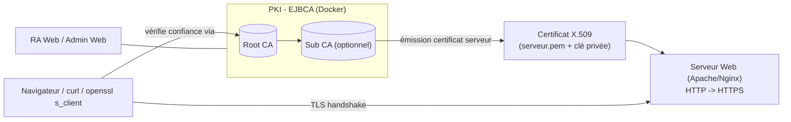

# Mise en place d'une Autorité de Certification (PKI) avec EJBCA et passage de HTTP vers HTTPS

Projet de cours — Master SSI, Cryptographie (2026).
Équipe de 3 personnes, une branche Git par membre.

## 1. Objectif

Déployer une PKI privée avec **EJBCA Community** (Enterprise Java Beans Certificate Authority),
émettre un certificat serveur depuis cette CA, puis migrer un serveur web d'**HTTP vers HTTPS**
en utilisant ce certificat. Le tout est documenté et démontrable via Docker.

Livrables :
- Une PKI fonctionnelle (Root CA, éventuellement Sub CA, profils de certificats, End Entity).
- Un serveur web migré de HTTP → HTTPS avec le certificat émis par notre CA.
- Un rapport expliquant les concepts (PKI, X.509, chaîne de confiance, CRL/OCSP) et les choix faits.
- Une démo reproductible (docker-compose) + captures/preuves (openssl s_client, navigateur, CRL).

## 2. Architecture



- **EJBCA Community** (image `keyfactor/ejbca-ce`) + **MariaDB** pour la base de données de la CA.
- **Root CA** auto-signée (clé RSA 4096, longue validité) → émet une **Sub CA** ou directement des
  certificats "End Entity" pour la démo (selon le temps disponible, la Sub CA est un bonus).
- Un **serveur web** (Apache ou Nginx, au choix de la branche 2) initialement en HTTP,
  reconfiguré en HTTPS avec le certificat émis par la CA, avec redirection HTTP → HTTPS.
- Le certificat racine (Root CA) est ajouté au **truststore** du client pour valider la chaîne
  sans avertissement de sécurité.

## 3. Répartition du travail (3 branches)

| Branche | Responsable | Contenu |
|---|---|---|
| `pki-ejbca-setup` | Ahmad Diop | Déploiement EJBCA (Docker Compose + MariaDB), création Root CA (et Sub CA si possible), profils de certificats, création du SuperAdmin, émission du certificat serveur (CSR ou génération par la CA) |
| `webserver-https-migration` | Papa Mamadou | Serveur web de démo en HTTP, migration vers HTTPS avec le certificat EJBCA, redirection HTTP→HTTPS, durcissement TLS (protocoles/ciphers), vérification avec `openssl s_client` / `testssl.sh` |
| `docs-rapport-tests` | Mame Fatou | Rapport (concepts PKI, X.509, CRL/OCSP, schéma d'archi), scénarios de test/validation (chaîne de confiance, révocation, expiration), README, captures d'écran, slides de soutenance si besoin |

Chaque branche pousse son travail puis ouvre une Pull Request vers `main` pour relecture croisée.
Voir [docs/repartition-des-taches.md](docs/repartition-des-taches.md) pour le détail des tâches.

## 4. Démarrage rapide (EJBCA)

```bash
cd infra/ejbca
docker compose up -d
docker compose logs -f ejbca   # récupérer l'URL d'accès (Admin Web / RA Web)
```

Voir [docs/guide-ejbca.md](docs/guide-ejbca.md) pour les étapes détaillées :
création du SuperAdmin, Root CA, profils de certificats, émission du certificat serveur.

## 5. Migration HTTP → HTTPS

Voir [docs/guide-https.md](docs/guide-https.md) et les configurations dans
[infra/webserver/](infra/webserver/) (Apache et Nginx).

## 6. Ressources utilisées

- [EJBCA - The Open-Source Certificate Authority](https://www.ejbca.org/)
- [Tutorial - Start out with EJBCA Docker container (Keyfactor Docs)](https://docs.keyfactor.com/ejbca/latest/tutorial-start-out-with-ejbca-docker-container)
- [Tutorial - Create your first Root CA using EJBCA (Keyfactor Docs)](https://docs.keyfactor.com/ejbca/latest/tutorial-create-your-first-root-ca-using-ejbca)
- [EJBCA and Docker — Streamlining PKI Management and TLS Certificate Issuance (Docker Blog)](https://www.docker.com/blog/ejbca-and-docker-streamlining-pki-management-and-tls-certificate-issuance/)
- [The Art of Hacking — Cryptography & PKI resources](https://github.com/The-Art-of-Hacking/h4cker/tree/master/cybersecurity-domains/cryptography-pki/cryptography-and-pki)

Synthèse complète de la recherche : [docs/recherche-ecosysteme-pki-2026.md](docs/recherche-ecosysteme-pki-2026.md)

## 7. Organisation Git

```
main                          # intégration finale, stable
├── pki-ejbca-setup           # Ahmad Diop
├── webserver-https-migration # Papa Mamadou
└── docs-rapport-tests        # Mame Fatou
```

Convention de commit : `type(scope): message` (ex: `feat(ejbca): ajoute docker-compose CA`).
